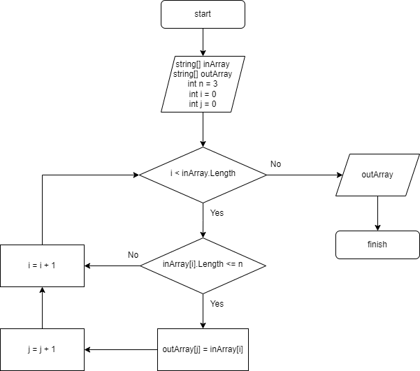

# Итоговая проверочная работа

## *Задача:* 
Написать программу, которая из имеющегося массива строк формирует новый массив из строк, длина которых меньше, либо равна 3 символам. Первоначальный массив можно ввести с клавиатуры, либо задать на старте выполнения алгоритма. При решении не рекомендуется пользоваться коллекциями, лучше обойтись исключительно массивами.

## **Решение:**

1. *Создаем исходный массив, элементы которого вводит пользователь;*

2. *Перебираем значения исходного массива;*

3. *Делаем проверку, соответствует ли значение массива условию: __длина строки меньше, либо равна 3__;*

4. *Если элемент массива удовлетворяет условию, кладем его в новый массив;*

5. *Повторяем пункты 3 и 4, пока не закончатся все элементы исходного массива;*

6. *Возвращаем новый заполненный массив.*

**Блок-схема алгоритма:**

__*Работа программы:*__

* Для запуска программы напишите в терминале: *dotnet run*

* Введите значения, разделяя их пробелом. Например: *Hello 2 world :-)*

* Пример вывода программы: [“Hello”, “2”, “world”, “:-)”] → [“2”, “:-)”]
